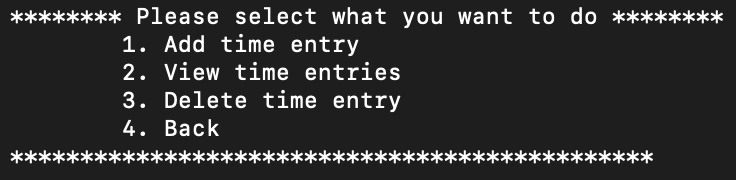

<div id="top"></div>

[![Python][python-shield]][python-url]
[![Stargazers][stars-shield]][stars-url]
[![Issues][issues-shield]][issues-url]
[![MIT License][license-shield]][license-url]
[![LinkedIn][linkedin-shield]][linkedin-url]


<br />
<div align="center">
  <a href="https://github.com/francinv/time-keeper">
    
  </a>

<h3 align="center">TimeKeeper</h3>

  <p align="center">
    This is a simple console application created in Python for monitoring time. 
    <br />
    <a href="https://github.com/francinv/time-keeper/issues">Report Bug</a>
    ·
    <a href="https://github.com/francinv/time-keeper/issues">Request Feature</a>
  </p>
</div>

<details>
  <summary>Table of Contents</summary>
  <ol>
    <li>
      <a href="#about-the-project">About The Project</a>
      <ul>
        <li><a href="#built-with">Built With</a></li>
      </ul>
    </li>
    <li>
      <a href="#getting-started">Getting Started</a>
      <ul>
        <li><a href="#prerequisites">Prerequisites</a></li>
        <li><a href="#installation">Installation</a></li>
      </ul>
    </li>
    <li><a href="#usage">Usage</a></li>
    <li><a href="#license">License</a></li>
    <li><a href="#contact">Contact</a></li>
  </ol>
</details>

## About The Project

![Screen shot of TimeKeeper][product-screenshot]

TimeKeeper is a simple console application for monitoring time used on something. The application is built with Python. As you can see in the screenshot below there are 3 different menus:

- Group management
- Time management
- Data

In section <a href="#usage">Usage</a>, I will explain how the application can be used, and explain what the different menus do.

<p align="right">(<a href="#top">back to top</a>)</p>

### Built With

* [Python](https://www.python.org)

## Getting Started

The project is console only, so you can run the application from the command line. There is also possible to use pyinstaller to create an executable file.

### Prerequisites

You must have python and pipenv installed.
* python
  ```sh
  python --version 
  ```
* pipenv
    ```sh
    pip install pipenv
    ```

### Installation

1. Clone the repo
   ```sh
   git clone https://github.com/francinv/time-keeper.git
   ```
2. Initiate the environment
   ```sh
   pipenv shell
   ```
3. Install packages
   ```sh
   pipenv install
   ```

### Running application

1. Go into the directory
    ```sh
    cd src
    ```
2. Run the application
    ```sh
    python main.py
    ```
Application should now be running in the console.

### Creating executable file and running it

1. Go into the directory
    ```sh
    cd src
    ```
2. Create executable using pyinstaller
    ```sh
    pyinstaller main.py
    ```
3. Run the executable (command line)
    ```sh
    ./dist/main/main
    ```
**The executable can also be run by double clicking the executable file.**

<p align="right">(<a href="#top">back to top</a>)</p>

<!-- USAGE EXAMPLES -->
## Usage

In this space I will explain how the application can be used and its functionality.

### Group Management


By pressing 1 on the main menu, you will be able to manage groups. We have groups in the application, so that time entries can be added to different groups. Different actions:

1. Create a new group:

    This will create a new group with the name you specify.

    
2. View all groups

    This will show all groups in the application.

    
3. Delete a group

    This will delete the group with the name you specify.

    
4. Back to main menu

### Time Management


By pressing 2 on the main menu, you will be able to manage time. When either creating, viewing or deleting a time entry the user will be prompted to input which group they want to do the specific action on. Different actions:

1. Create a new time entry:

    This will create a new time entry with the specified group.
    
2. View all time entries

    This will show all time entries for a specific group.

    
3. Delete a time entry

    This will delete the time entry with the specified group.

    
4. Back to main menu

### Data


By pressing 3 on the main menu, you will be able to do specific action with the data persisted. Different actions:

1. Get time for a month:

    This will return the time spent on a specific group for a specific month. Example:
    

2. Export data for a month:

    This will export the time spent on a specific group for a specific month to an excel file. Example:
    
3. Export all data for a specific group

    This will export all time spent on a specific group to an excel file. Example:
    
4. Back to main menu

### Storage 
The data will be stored in a json file. The file is located in /Users/<username>/TimeKeeper/time-keeper-data.json.

Here is an example of how the JSON file looks like:


<p align="right">(<a href="#top">back to top</a>)</p>

<!-- LICENSE -->
## License

Distributed under the MIT License. See `LICENSE.txt` for more information.

<p align="right">(<a href="#top">back to top</a>)</p>


<!-- CONTACT -->
## Contact

Francin Vincent - [@francinvincent](https://linkedin.com/in/francinvincent) - francin.vinc@gmail.com

Project Link: [https://github.com/francinv/time-keeper](https://github.com/francinv/time-keeper)

<p align="right">(<a href="#top">back to top</a>)</p>


[python-shield]: https://img.shields.io/badge/Python-14354C?style=for-the-badge&logo=python&logoColor=white
[python-url]: https://python.org
[stars-shield]: https://img.shields.io/github/stars/francinv/time-keeper.svg?style=for-the-badge
[stars-url]: https://github.com/francinv/time-keeper/stargazers
[issues-shield]: https://img.shields.io/github/issues/francinv/time-keeper.svg?style=for-the-badge
[issues-url]: https://github.com/francinv/time-keeper/issues
[license-shield]: https://img.shields.io/github/license/francinv/time-keeper.svg?style=for-the-badge
[license-url]: https://github.com/francinv/time-keeper/blob/master/LICENSE.txt
[linkedin-shield]: https://img.shields.io/badge/-LinkedIn-black.svg?style=for-the-badge&logo=linkedin&colorB=555
[linkedin-url]: https://linkedin.com/in/francinvincent
[product-screenshot]: images/screenshot.png